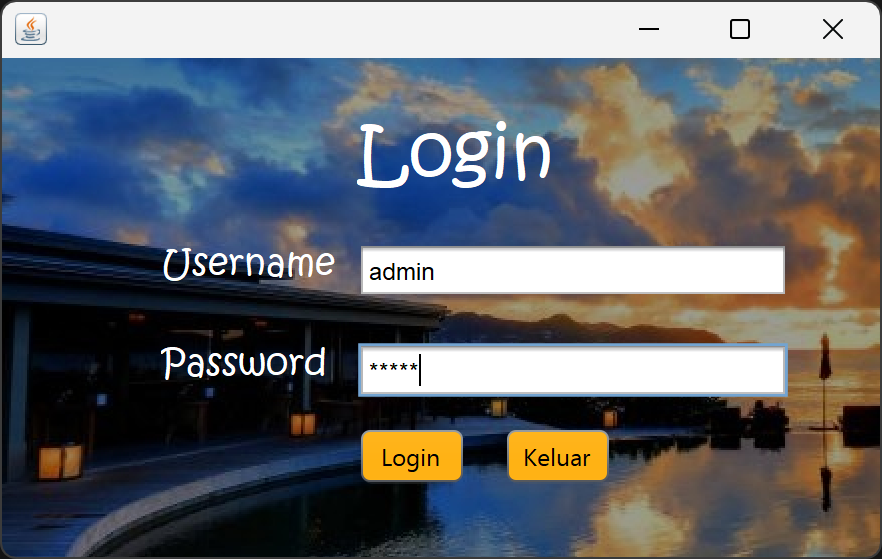
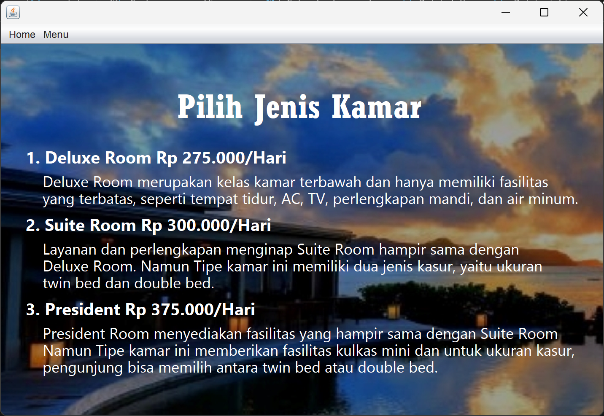
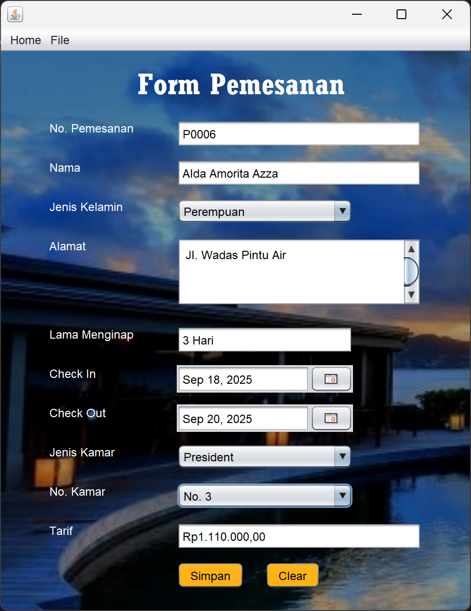
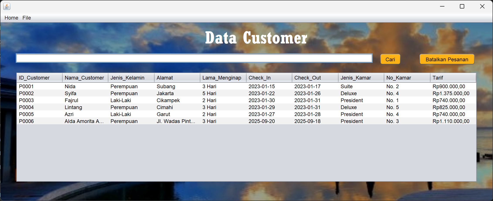

# 🏨 Aplikasi Pemesanan Hotel

Aplikasi desktop berbasis **Java (NetBeans)** untuk mengelola pemesanan hotel, dengan dukungan koneksi ke **database MySQL**.

## 🚀 Fitur
- Registrasi dan manajemen pelanggan
- Manajemen data kamar (jenis, harga, status)
- Pemesanan kamar dengan tanggal check-in/check-out
- Perhitungan biaya dan detail transaksi
- Laporan pemesanan
  
## ⚙️ Teknologi
- **Java (JDK 19 / sesuai NetBeans)**  
- **NetBeans IDE**  
- **MySQL + phpMyAdmin**

## 📥 Prasyarat
- **Java JDK** (disarankan JDK 19) – [Download JDK di sini](https://www.oracle.com/java/technologies/javase/jdk19-archive-downloads.html)
- **NetBeans IDE** (atau IDE Java lain yang mendukung Swing)
- **XAMPP** (untuk MySQL dan phpMyAdmin)

## 📂 Membuka Project & Setting JDK
1. Download file ZIP/RAR **Aplikasi Pemesanan Hotel** dan extract.
2. Buka **NetBeans → File → Open Project**.
3. Pilih folder `PemesananHotel` → open project.
4. Secara default, project menggunakan **JDK 19**.  
   Jika IDE berbeda versi JDK:
   - Klik kanan project → **Properties → Source/Binary Format** → pilih JDK sesuai laptop/PC.

## 🎨 Mensetting Background Aplikasi
1. Buka `FrmLogin.java` → tab **Design**.
2. Klik kanan background biru → **Properties → icon → External Image**.
3. Pilih gambar dari folder `BackgroundAplikasi/`:
   - `Login dan Home.png` → FrmLogin & Home  
   - `Tambah Data dan Laporan.png` → TambahData & Laporan
4. Klik **Open → OK → Close**.

## 📦 Menambahkan Library & JAR

### 1. AbsoluteLayout
- Klik kanan **Libraries → Add JAR/Folder...**  
- Pilih `AbsoluteLayout.jar` dari folder `AbsoluteLayout/`.

### 2. JCalendar
1. Menu **Tools → Libraries → New Library...** → beri nama `JCalendar`.
2. Klik **Add JAR/Folder** → pilih file `JCalendar.jar`.
3. Tambahkan library **Connector MySQL** ke dalam project juga.
4. Tambahkan komponen **JDateChooser**:
   - Menu **Tools → Palette → Swing/AWT Components → Add from Library**.
   - Pilih **JCalendar → DateChooser** → kategori Swing Control.

### 3. MySQL Connector
- Klik kanan **Libraries → Add JAR/Folder...**
- Tambahkan:
  - `mysql-connector-java-5.1.23-bin.jar`
  - `rs2xml.jar`

## 🗄️ Import Database ke MySQL
1. Jalankan **XAMPP → Start Apache & MySQL**.
2. Buka browser → akses `http://localhost/phpmyadmin`.
3. Buat database baru dengan nama `Hotel`.
4. Pilih database Hotel → **Import → Choose File → DatabaseHotel/hotel.sql**.  
5. Klik **Open → Impor**.

## 🚀 Menjalankan Aplikasi
1. Jalankan project di **NetBeans**.
2. Login default:
   - Username: `admin`
   - Password: `admin`

## 🖼️ Tampilan Aplikasi

| Login | Home |
|-------|------|
|  |  |

| Tambah Data | Laporan |
|-------------|---------|
|  |  |

